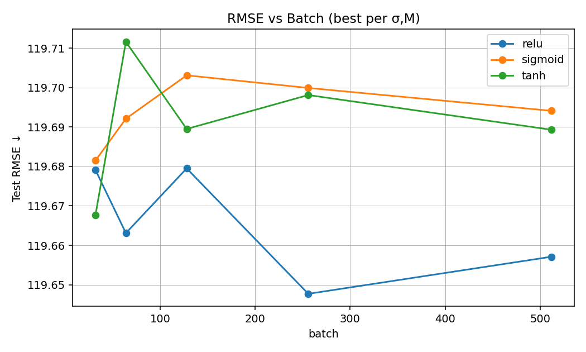
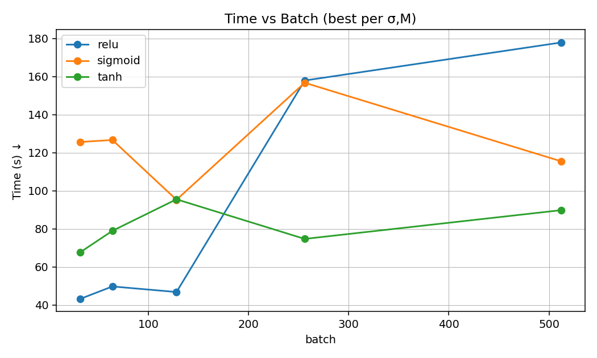
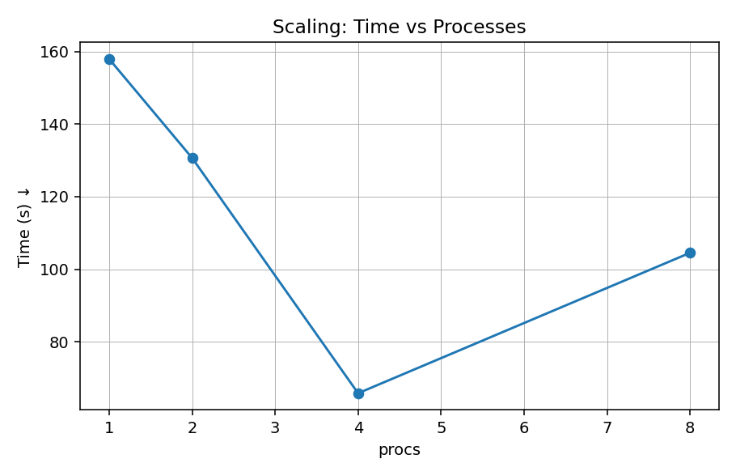
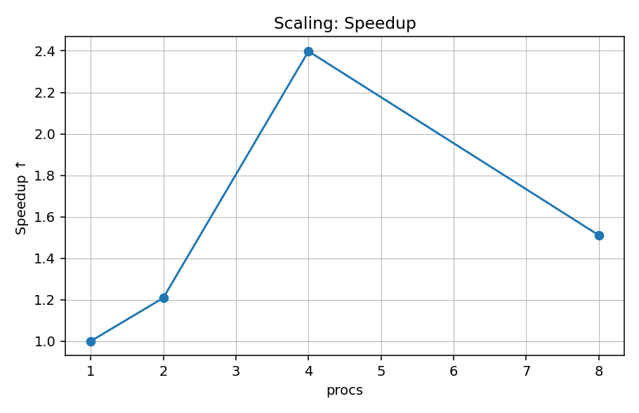
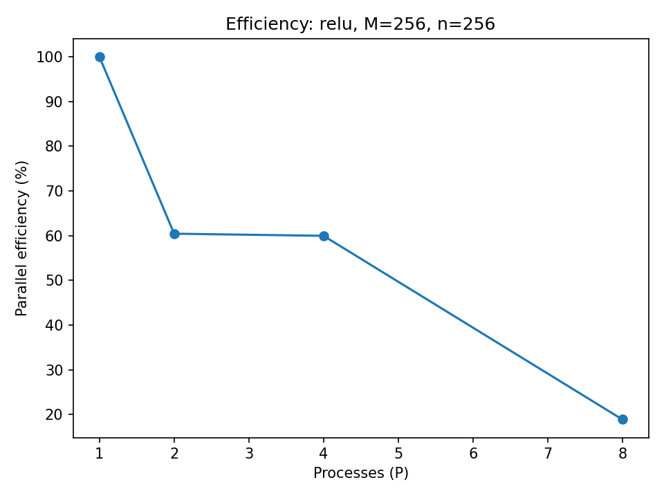

# DSS5208 Project 1 — Distributed Training on NYC Taxi (MPI)

Scalable training of a 1-hidden-layer neural network on NYC taxi data using MPI (mpi4py).
This repo runs a σ×M sweep (≥3 activations × ≥5 batch sizes), logs training histories, reports train/test RMSE, and measures strong scaling (P = 1, 2, 4, 8).

> Data note: raw/large data (```nytaxi2022.csv```, ```*.npz```, ```*.npy```, ```memmap_data/```) are not tracked in Git. See ```.gitignore```.

---

## Repo layout

```text
Project 1/
├─ train_mpi.py              # UPDATED: supports --npy_root for memmap shard loading
├─ prep_memmap_from_npz.py   # Export X_*.npy / y_*.npy from the cleaned NPZ (run once)
├─ data_prep.py              # (optional) CSV → nytaxi2022_cleaned.npz (run once)
├─ plot_history.py           # Plot R(theta) vs iteration from history.csv
│
├─ sweep_debug.ps1           # One quick run: checks env, trains, plots, writes results/debug_summary.csv
├─ sweep.ps1                 # σ×M sweep at P=4 (auto-detects memmap; writes results/run_summary.csv)
├─ scaling.ps1               # Strong scaling at P=1,2,4,8 (auto-detects memmap)
├─ summarize_results.py      # (optional) makes summary tables/plots from sweep
├─ scaling_summary.py        # (optional) makes summary tables/plots from scaling
│
├─ results/                  # (tracked) small CSV summaries
├─ plots/                    # (tracked) figures
├─ histories/                # (tracked) copied history_*.csv per run
│
├─ memmap_data/              # (generated, local-only; ignored) X_train.npy, y_train.npy, ...
├─ history.csv               # (generated) last run’s log
├─ model_final.npz           # (generated)
├─ nytaxi2022_cleaned.npz    # (generated)
└─ nytaxi2022.csv            # (raw)
```

## Requirements

- Python 3.10+ (you used 3.13)

- Packages: ```numpy```, ```pandas```, ```matplotlib```, ```mpi4py```

```powershell
python -m pip install --upgrade pip
python -m pip install -r requirements.txt
```

- MPI runtime:

> - Windows: MS-MPI (mpiexec).

> - macOS/Linux: OpenMPI/MPICH (mpiexec).

> - verify
```powershell
Get-Command mpiexec
mpiexec -n 2 py -c "from mpi4py import MPI; print('rank', MPI.COMM_WORLD.Get_rank(), 'of', MPI.COMM_WORLD.Get_size())"
```

## Quickstart (Windows / PowerShell)

### 1. Open a terminal here & activate venv
```powershell
cd "C:\Users\...\Projects\Project 1"
if (-not (Test-Path .\.venv)) { py -m venv .venv }
.\.venv\Scripts\Activate.ps1
python -m pip install --upgrade pip
python -m pip install -r requirements.txt
```
### 2. Set per-rank BLAS threads (avoid oversubscription with MPI)
```powershell
$env:OPENBLAS_NUM_THREADS='1'
$env:MKL_NUM_THREADS='1'
$env:NUMEXPR_NUM_THREADS='1'
$env:OMP_NUM_THREADS='1'
```
### 3. Create the cleaned NPZ (once)
(Skip if ```nytaxi2022_cleaned.npz``` already exists.)

```powershell
python .\data_prep.py --input_path .\nytaxi2022.csv --output_path .\nytaxi2022_cleaned.npz
```
### 4. Export memmap arrays (once)
```powershell
python .\prep_memmap_from_npz.py --npz .\nytaxi2022_cleaned.npz --outdir .\memmap_data
```
### 5. Preflight (1 quick run)
```powershell
Set-ExecutionPolicy -Scope Process -ExecutionPolicy Bypass
Unblock-File .\sweep_debug.ps1
.\sweep_debug.ps1
```
> Outputs:

- ```histories\history_relu_bs256_n256_P4.csv```

- ```plots\trainhist_relu_bs256_n256_P4.png```

- ```results\debug_summary.csv```

### 6. Full σ×M sweep (P=4)
```powershell
Unblock-File .\sweep.ps1
.\sweep.ps1
```

> Outputs:

- ```results\run_summary.csv```, ```results\top5_overall.csv```

- ```plots\rmse_vs_batch.png```, ```plots\time_vs_batch.png```

- ```histories\history_<tag>.csv```, ```plots\trainhist_<tag>.png```

### 7. Strong-scaling runs (P = 1,2,4,8)

Edit scaling.ps1 to pick your (activation, batch, hidden), then:
```powershell
Unblock-File .\scaling.ps1
.\scaling.ps1
```

> Outputs:

- ```results/scaling_table.csv```

- ```plots/scaling_time.png```, ```plots/scaling_speedup.png```, ```plots/scaling_efficiency.png```

 macOS/Linux notes: activate venv with ```source .venv/bin/activate```, set the same env vars with export, use the same ```mpiexec``` commands.


## Results (example)

Insert your own figures, e.g.:







## Reproducibility tips

- Use the same seed (```--seed```) across runs to minimize randomness.

- Ensure BLAS threads = 1 per rank (env vars above) for fair scaling.

- Confirm you’re using the repo venv:

>>>```python -c "import sys; print(sys.executable)"``` → should point to ```...\Project 1\.venv\Scripts\python.exe.```
## Troubleshooting

- ```unrecognized arguments: --npy_root```
- Make sure ```train_mpi.py``` is the updated version (supports ```--npy_root```).

- ```history.csv``` not found or ```model_final.npz``` not found
>>> Training crashed earlier—scroll up for the Python error. Try a smaller ```--hidden``` (e.g., 128) or larger ```--eval_block``` (e.g., 200000).

- P=8 slower than P=4
>>> Check the four env vars are set to ```1```; try a larger batch (e.g., 512).

- ```mpiexec``` not found
>>> Install MS-MPI (Windows) or OpenMPI/MPICH (macOS/Linux) and ensure it’s on ```PATH```.

## Implementation details / improvements

- Broadcast only minibatch indices per step (not full epoch permutations).

- Chunked RMSE (--eval_block) to bound memory during eval.

- Subsampled periodic eval (--eval_sample) for fast R(θ) tracking.

- No-copy loads for float32 arrays to avoid multi-GB duplicates.

- Explicit biases (no giant temporary concatenations).

- Early-stop patience on R(θ) trend.

## How it satisfies the project requirements

- Data “stored nearly evenly”: each rank mmaps only its slice of ```X_train.npy/y_train.npy```; test is evaluated in parallel by slicing ```X_test.npy``` across ranks.

- Parallel stochastic gradient: each rank computes local minibatch gradients; global average via ```MPI.Allreduce```.

- σ×M variations: ```sweep.ps1``` runs at least 3 activations (```relu```, ```tanh```, ```sigmoid```) × 5 batch sizes (32, 64, 128, 256, 512).
Hidden units ```n``` are chosen per (σ, M) rule-of-thumb in the script; adjust as needed.

- Training history: ```train_mpi.py``` logs ```R(θ_k)``` (sampled MAE) vs iteration to ```history.csv```; ```plot_history.py``` renders figures.

- RMSE (train/test): final parallel RMSEs are printed and stored in ```model_final.npz``` meta; sweep scripts collect them into CSVs.

- Training times & scaling: wall-clock time per run saved in meta; ```scaling.ps1``` measures time vs processes and computes speedup/efficiency.