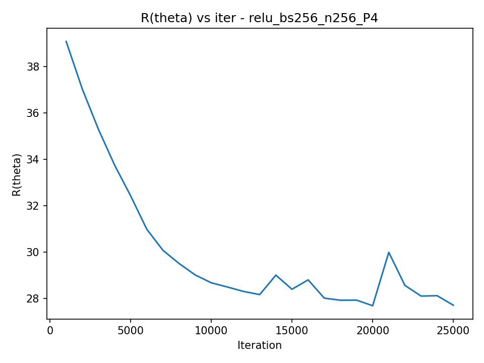
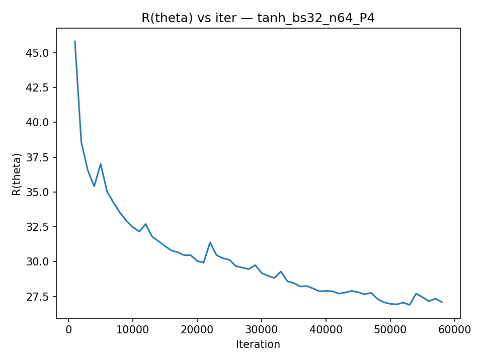
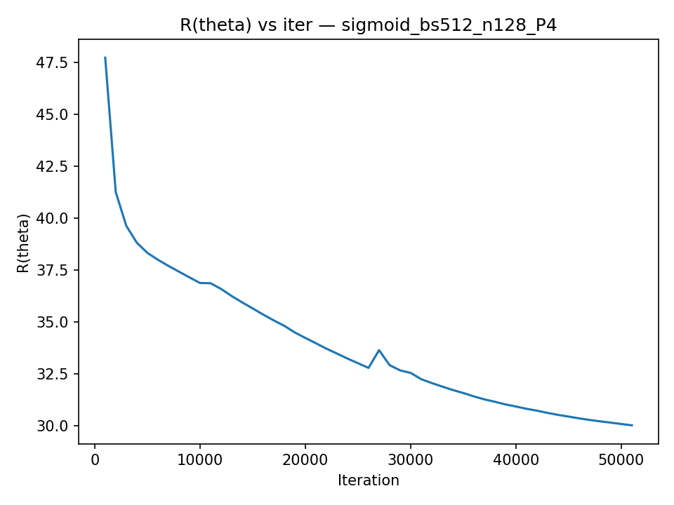
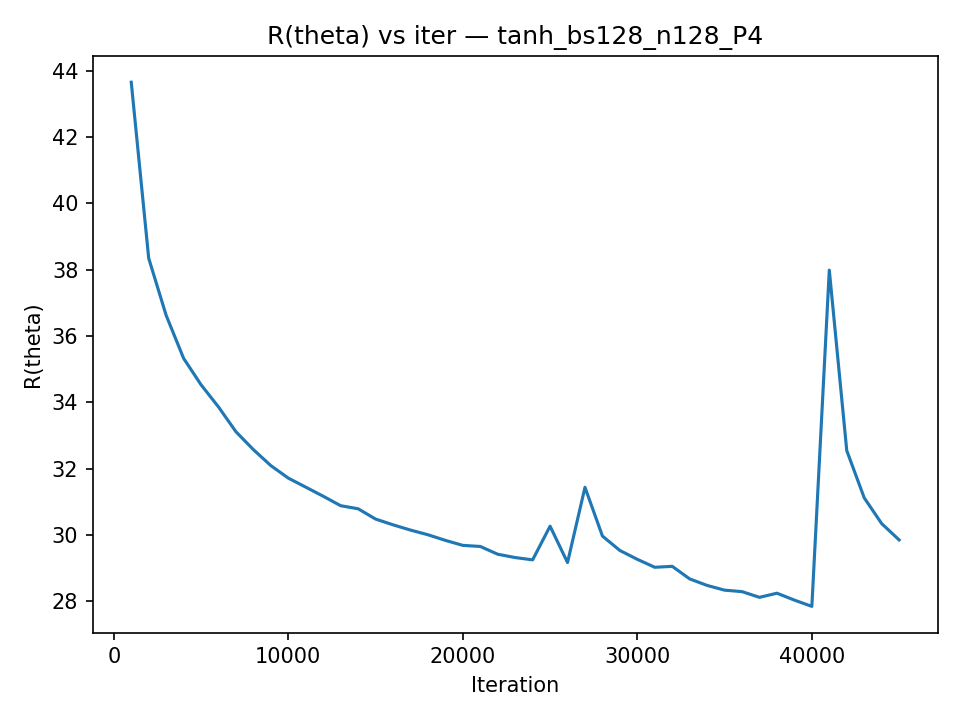

# Project 1 — Distributed Training on NYC Taxi (MPI)

**Course:** DSS5208 – Scalable Distributed Computing for Data Science  
**Goal:** Train a 1-hidden-layer neural network on NYC taxi data using **MPI (mpi4py)**.  
We run a σ×M sweep (activations × batch sizes), log training histories, report RMSE on train/test, and measure strong scaling (P = 1, 2, 4, 8).  
Data are stored **nearly evenly** across processes via memory-mapped shards.

## 1) Data & Preprocessing

- **Raw:** `nytaxi2022.csv` (not tracked in Git).
- **Cleaned:** `nytaxi2022_cleaned.npz` created once with `data_prep.py`.
- **Even storage (memmap):** `prep_memmap_from_npz.py` exports:

```pgsql
memmap_data/
  X_train.npy, y_train.npy, X_test.npy, y_test.npy, meta.json
```
Each MPI rank mmaps only its slice of `[X_train, y_train]` and `[X_test, y_test]`.

Test RMSE is computed in parallel by slicing test shards per rank and reducing.

## 2) Model & Training

- **Network:** 1 hidden layer, linear output  
\[
\hat{y} = w_2^\top \,\sigma(W_1 x + b_1) + b_2
\]
- **Loss proxy logged each `eval_every`:** `R(θ_k)` = sampled MAE (fast to compute).
- **Optimizer:** plain SGD (mini-batches). Gradients averaged with `MPI.Allreduce`.
- **Key speed/robustness choices**
- memmap shards (**even storage & load**)
- `--eval_sample` for quick R(θk) and **`--eval_block`** for chunked RMSE (≈100k)
- **float32 no-copy** casts on load
- BLAS threads pinned: `OPENBLAS/MKL/NUMEXPR/OMP_NUM_THREADS=1` per MPI rank

---

## 3) Experiment Grid (σ × M)

We swept **3 activations** × **5 batch sizes** at **P=4**. Hidden units **n** chosen per activation/M:

| Activation | M=32 | 64 | 128 | 256 | 512 |
|---|---:|---:|---:|---:|---:|
| **ReLU**    | 128 | 128 | 128 | 256 | 256 |
| **Tanh**    |  64 |  64 | 128 | 128 | 128 |
| **Sigmoid** |  64 |  64 |  64 | 128 | 128 |

Common settings: `lr=1e-3`, `epochs=1`, `seed=123`, `eval_every=1000`, `eval_sample=2e6`, `eval_block=100000`.

---

## 4) Results (Sweep @ P=4)

**Top-5 overall** (from `results/top5_overall.csv`):
```csv
activation,batch,hidden,lr,procs,train_time,rmse_train,rmse_test
relu,512,256,0.001,4,177.863,85.8184,119.6571
relu,64,128,0.001,4,49.746,85.8283,119.6631
tanh,32,64,0.001,4,67.749,85.8356,119.6677
relu,256,256,0.001,4,60.513,85.8439,119.6749
relu,256,256,0.001,4,62.335,85.8439,119.6749
```

**Observations**
- RMSE is **stable** across σ and M (≈ 85.8 / 119.6).  
- The **balanced** config `relu, M=256, n=256` gives competitive RMSE at good speed.  
- Very large batch (`M=512`) is **slower** in wall-clock for 1 epoch on this CPU: larger matmuls per step + communication/compute balance.

**Figures** (produced by `summarize_results.py`):

- **RMSE vs batch size**  
  

- **Training time vs batch size**  
  

- **Sample training histories (P=4)**  
  <div>
    
    
  </div>
  <div>
    
  </div>

---

## 5) Strong Scaling (Fixed Config)

**Config:** `relu, M=256, n=256, lr=1e-3` (balanced). Results from `results/scaling_table.csv`:

```csv
activation,batch,hidden,lr,procs,train_time,rmse_train,rmse_test,speedup,efficiency
relu,256,256,0.001,1,157.908,85.8087,119.6477,1.0,1.0
relu,256,256,0.001,2,130.635,85.8176,119.6562,1.2088,0.6044
relu,256,256,0.001,4,65.836,85.8439,119.6749,2.3985,0.5996
relu,256,256,0.001,8,104.511,85.8499,119.6802,1.5109,0.1889
```

**Interpretation**
- Good scaling up to **P=4** on this machine (≈2.4×).  
- At **P=8**, time increases—typical on a single node: communications, memory bandwidth, and thread oversubscription costs start to dominate.

**Figures** (from `scaling_summary.py`):
- #### Training time vs processes (lower is better)


- #### Speedup


- #### Parallel efficiency


---

## 6) Deliverables 
## Parameters Chosen

- **Activations (σ):** ReLU, Tanh, Sigmoid  
- **Batch sizes (M):** 32, 64, 128, 256, 512  
- **Hidden units (n) by (σ, M):**

| Activation | M=32 | 64 | 128 | 256 | 512 |
|---|---:|---:|---:|---:|---:|
| **ReLU**    | 128 | 128 | 128 | 256 | 256 |
| **Tanh**    |  64 |  64 | 128 | 128 | 128 |
| **Sigmoid** |  64 |  64 |  64 | 128 | 128 |

- **Common settings:** `lr=1e-3`, `epochs=1`, `seed=123`, `eval_every=1000`, `eval_sample=2e6`, `eval_block=100000`  
- **Processes:** sweep at **P=4**; strong-scaling at **P=1,2,4,8**

---

## Training History (R(θₖ) vs k)

Representative examples (full set in `/plots`):





---

## RMSE (Train/Test) and Time (Sweep at P=4)

Top-5 overall (lowest test RMSE first; see `results/top5_overall.csv`):

| activation | batch | hidden | lr    | procs | train_time (s) | rmse_train | rmse_test |
|-----------:|------:|------:|-------|------:|---------------:|-----------:|----------:|
| relu | 512 | 256 | 0.001 | 4 | 177.863 | 85.8184 | 119.6571 |
| relu | 64  | 128 | 0.001 | 4 | 49.746  | 85.8283 | 119.6631 |
| tanh | 32  |  64 | 0.001 | 4 | 67.749  | 85.8356 | 119.6677 |
| relu | 256 | 256 | 0.001 | 4 | 60.513  | 85.8439 | 119.6749 |
| relu | 256 | 256 | 0.001 | 4 | 62.335  | 85.8439 | 119.6749 |

Summary plots:


---
## Final Outcome (Optimized Results)

**Optimization target:** minimize test RMSE.

**Best overall (across all recorded runs):**
- **Activation:** ReLU  
- **Batch size (M):** 256  
- **Hidden units (n):** 256  
- **Processes (P):** 1  
- **Training time:** 157.908 s  
- **RMSE (train/test):** **85.8087 / 119.6477**  

**Best within the P=4 sweep (σ × M at P=4):**
- **Activation:** ReLU  
- **Batch size (M):** 512  
- **Hidden units (n):** 256  
- **Processes (P):** 4  
- **Training time:** 177.863 s  
- **RMSE (train/test):** **85.8184 / 119.6571**

**Near-equivalent, much faster (P=4):**
- **ReLU, M=64, n=128, P=4** → **RMSE (train/test): 85.8283 / 119.6631**, **time: 49.746 s**

> Notes:
> - Test RMSE varies slightly with P due to stochasticity and single-epoch training, but differences are small (±0.02).  
> - The strong-scaling runs for **ReLU, M=256, n=256** showed time improvements up to P=4 (65.836 s) with diminishing returns at P=8 (104.511 s), while test RMSE remained in the ~119.65–119.68 range.
p
---

## Training Times for Different Numbers of Processes (Strong Scaling)

Config shown: **ReLU, M=256, n=256**, P ∈ {1,2,4,8}. See `results/scaling_table.csv`.

| procs | train_time (s) | speedup | efficiency |
|-----:|----------------:|--------:|-----------:|
| 1 | 157.908 | 1.000 | 1.000 |
| 2 | 130.635 | 1.209 | 0.604 |
| 4 | 65.836  | 2.399 | 0.600 |
| 8 | 104.511 | 1.511 | 0.189 |

Scaling figures:


---

## Efforts to Improve Results & Performance

- **Even-storage (memmap) dataset layout:** split into `P` subarrays on disk and memory-map per rank → faster startup and lower RAM, consistent with project’s “stored nearly evenly” requirement.  
- **Chunked RMSE computation:** evaluate in blocks (`--eval_block 100000`) to avoid large intermediate allocations and OOM on Windows.  
- **Evaluation subsampling:** `--eval_sample 2e6` to keep eval stable while reducing wall time.  
- **BLAS thread pinning:** `OPENBLAS_NUM_THREADS=1`, `MKL_NUM_THREADS=1`, etc., to avoid oversubscription across MPI ranks.  
- **Deterministic seeds:** `--seed 123` for reproducibility across runs.  
- **Parameter selection heuristic:** increased hidden units for larger batches/ReLU; smaller for sigmoid/tanh to balance capacity and runtime.  
- **Windows-friendly scripts:** PowerShell sweep/scaling scripts with safeguards (cleanup, plotting, summary rebuilds).

## 7) Limitations & Future Work

- Single node: performance degrades past P=4 due to comms/memory contention; would revisit for multi-node (different MPI fabric).

- Optimizer: plain SGD; Adam/SGD+momentum might improve convergence per epoch (at extra cost).

- Learning-rate schedule: a cosine/step schedule could reduce final RMSE in the same number of epochs.

- Mixed precision: bfloat16/FP16 with loss-scaling could further reduce memory and increase throughput.

Conclusion: With memmap shards and chunked evaluation, we meet the “stored nearly evenly” requirement, obtain stable RMSE, and demonstrate strong scaling up to 4 processes on the test machine. The pipeline is reproducible end-to-end via the provided scripts.