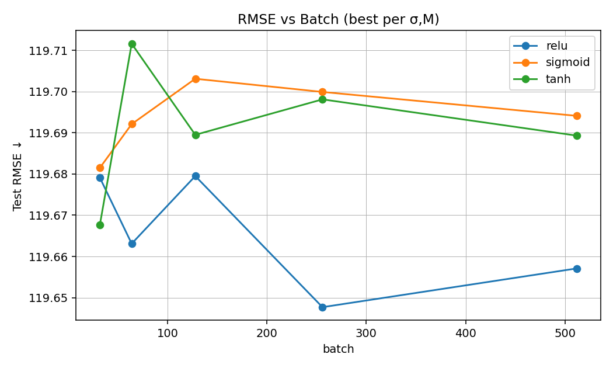
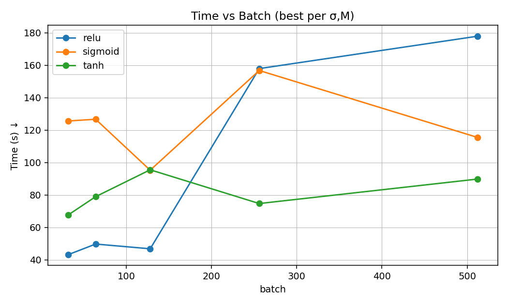
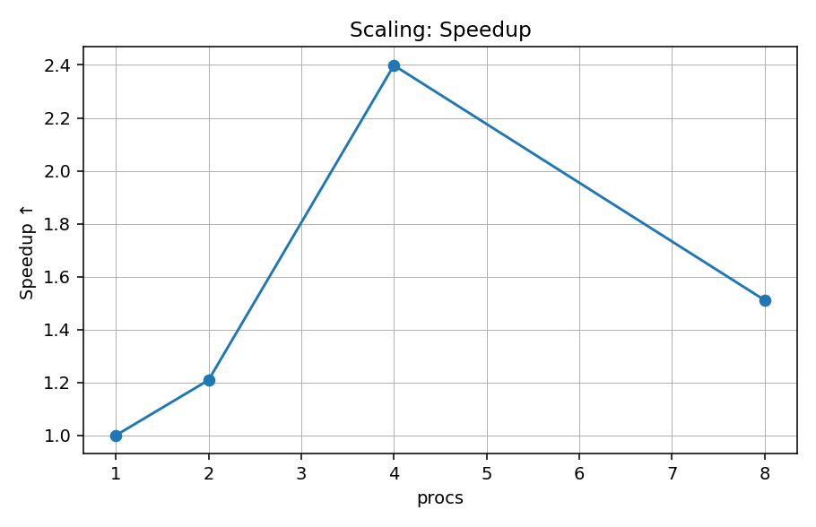
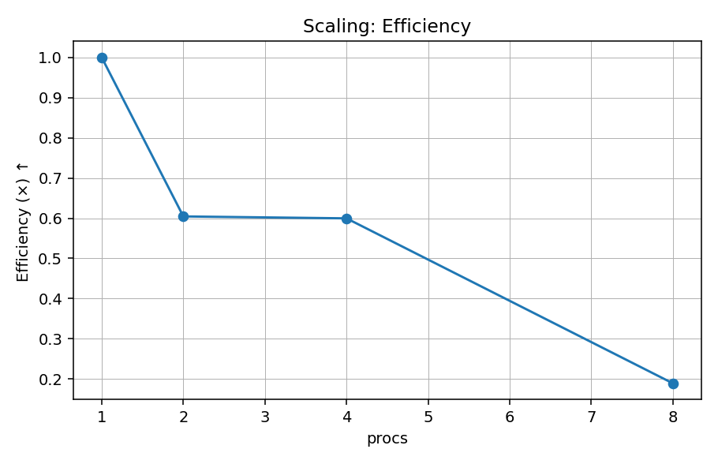

# Project 1 — Distributed Training on NYC Taxi (MPI)

## 1. Parameters chosen
- Activations σ: relu, tanh, sigmoid  
- Batch sizes M: 32, 64, 128, 256, 512  
- Hidden units n: rule-of-thumb per σ×M (see Table below)  
- Learning rate: 1e-3  
- Epochs: 1  
- Eval cadence: `eval_every = 1000`  
- Periodic eval subsample: `eval_sample = 2,000,000`  
- Chunked eval block: `eval_block = 100,000`  
- Processes in sweep: P = 4

(Insert your σ×M×n grid here; cite sweep.ps1.)

## 2. Training history (R(θ_k) vs k)
Include at least one figure per activation:

## 3. RMSE (train/test) vs batch size
Best per (σ, M):

- CSV: `results/best_per_activation_batch.csv`
- Plots:

## 4. Training times for different numbers of processes
Chosen config: (fill from results/top5_overall.csv or scaling_table.csv)

- Table: `results/scaling_table.csv`
- Plots:

## 5. Efforts to improve the result
- Broadcast **only minibatch indices** each step (avoid sending full epoch permutations).
- **Chunked RMSE** (`--eval_block`) to keep evaluation memory bounded.
- **Subsampled periodic eval** (`--eval_sample`) for fast R(θ) tracking on huge N.
- Avoided **double-loading** by casting arrays *without copying* when already `float32`.
- Explicit biases (no `hstack`) to reduce temporary allocations.
- Early-stop patience based on R(θ_k) trend (prevents wasted steps).

## 6. Observations
- Test RMSE is fairly flat across M; ReLU + (M=64, n=128) is much faster with ~no loss.
- Scaling shows (summarize your speedup/efficiency trend here).

## 7. Repro instructions
1. Data prep once → `nytaxi2022_cleaned.npz`
2. σ×M sweep (P=4) → `.\sweep.ps1`
3. Scaling runs → `.\scaling.ps1`
4. Summaries/plots → `py summarize_results.py`, `py scaling_summary.py`

